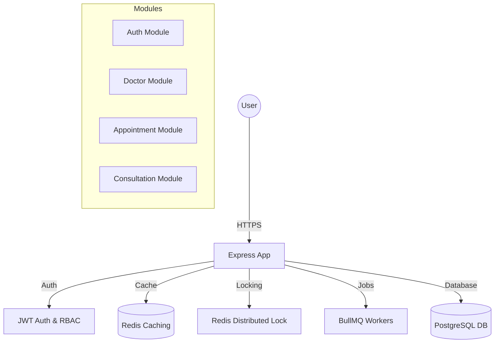
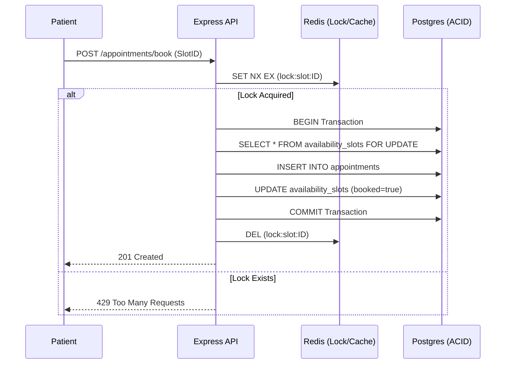

# Amrutam Telemedicine Backend - Architecture Document

## 1. Executive Summary
This document provides a technical overview of the Amrutam Telemedicine Backend. The system is designed for high reliability, scalability, and security, capable of handling 100k daily consultations.

## 2. System Overview
The backend is built as a **Modular Monolith** using Node.js and TypeScript. It leverages PostgreSQL for relational data, Redis for caching and concurrency control, and BullMQ for asynchronous background processing.

## 3. High-Level Architecture

## 4. Key Design Decisions

### 4.1. RELIABILITY: Double Booking Prevention
To prevent double bookings in a high-concurrency environment, we implemented a two-layer safeguard:
1.  **Distributed Locking**: Using Redis (`SET NX EX`) to ensure only one process can attempt to book a slot at a time.
2.  **Database Transactions**: All booking operations are wrapped in PostgreSQL transactions (`BEGIN`, `COMMIT`, `ROLLBACK`) to ensure data atomicity.

### 4.2. SCALABILITY: Table Partitioning
The `audit_logs` table uses **Range Partitioning** by timestamp. This allows the database to handle millions of logs without performance degradation on the main tables.

### 4.3. PERFORMANCE: Multi-Layer Caching
*   **Search Caching**: Doctor search results are cached in Redis for 5 minutes.
*   **Profile Caching**: Doctor profile details are cached for 1 hour, significantly reducing DB hits for high-traffic profile views.

## 5. Security Posture
*   **Rate Limiting**: Implemented via `express-rate-limit` with Redis storage to prevent DDoS and Brute-force attacks.
*   **Audit Trails**: Every sensitive action (Consultations, Prescriptions, Auth) creates an immutable audit log.
*   **Idempotency**: All write operations (POST/PUT) are protected by a Redis-backed idempotency middleware.

## 6. Sequence Diagram: Booking Flow

## 7. Scalability & Availability Targets
| Metric | Target | Solution |
| :--- | :--- | :--- |
| **Daily Consultations** | 100k+ | Horizontal scaling, Partitioning |
| **Read Latency (p95)** | <200ms | Redis Caching, DB Indexing |
| **Write Latency (p95)** | <500ms | Async Jobs, Connection Pooling |
| **System Availability** | 99.95% | Health checks, Dockerized orchestration |

## 8. Backup & Disaster Recovery (DR)
*   **Database Backups**: Automated daily WAL archiving to S3/Cloud Storage using `pgBackRest`.
*   **Point-in-Time Recovery (PITR)**: Enabled via PostgreSQL WAL strategy to allow recovery to any specific second in the last 7 days.
*   **High Availability (HA)**: Recommended Multi-AZ deployment for RDS/Cloud SQL instances to handle regional failures.

## 9. Technical Stack
| Category | Technology |
| :--- | :--- |
| **Language** | TypeScript (Node.js) |
| **Framework** | Express.js |
| **Database** | PostgreSQL 15 |
| **Cache/Lock** | Redis 7 |
| **Background Jobs** | BullMQ (with Retry/Backoff) |
| **Containerization** | Docker & Docker Compose |
| **Logging** | Winston (Daily Rotation) |
